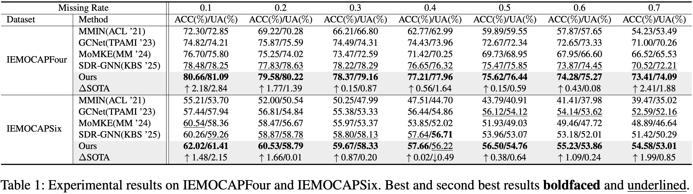
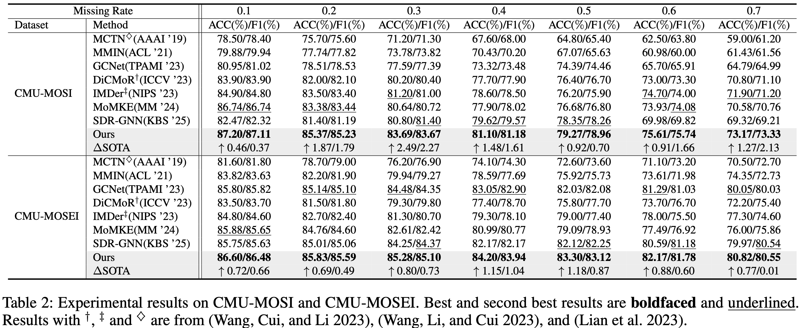

# [AAAI-26] Cross-modal Prompting for Balanced Incomplete Multi-modal Emotion Recognition
<h5 align="center">

🎆 Welcome to the repo of **ComP**! 🎆

If you feel this work helpful, please support us with your stars⭐ and cite our paper!


This repo contains the official **PyTorch** implementation of ComP for balanced incomplete multi-modal emotion recognition (IMER).

<!-- [](https://arxiv.org/abs/2501.15061)
[](https://huggingface.co/ZachMeng/PolaFormer/tree/main)
[](https://github.com/ZacharyMeng/PolaFormer/stargazers) -->
</h5>

## 🔥 News
- [2025/11/08]  🔥 Our paper has been accepted by **AAAI Conference on Artificial Intelligence** 2026 as an **oral paper**!


## 📖 Introduction

### Motivation

Although great progress has been made, current IMER methods still suffer from severe modality imbalance problem that hinders better performance. Specifically, such a problem can be summarized as:
1. **Modality performance gap**, *i.e.*, performances of different modalities vary greatly
2. **Modality under-optimization**, *i.e.*, modality-specific performance degrades after multi-modal co-training.
 <p align="center">
    
</p>

### Method

 To address this issue, we devise a novel **C**r**o**ss-**m**odal **P**rompting (ComP) method, which emphasizes coherent information by enhancing modality-specific features and improves the overall recognition accuracy by boosting each modality's performance. 
 
 Specifically, a progressive prompt generation module with a dynamic gradient modulator is proposed to produce concise and consistent modality semantic cues. Meanwhile, cross-modal knowledge propagation selectively amplifies the consistent information in modality features with the delivered prompts to enhance the discrimination of the modality-specific output. Additionally, a coordinator is employed to dynamically re-weight the modality outputs as a complement to the balance strategy to improve the model's efficacy.
 <p align="center">
    
</p>


### Results

The experimental results on 4 datasets against SOTA methods under different missing rates are listed below:
 <p align="center">
    
    
</p>


## 🚀 Run the Code

### Dependencies

- Python 3.8.20
- PyTorch == 1.12.0
- numpy == 1.24.3
- sklearn == 1.3.2

### Data preparation

Download data from Baidu Disk and modify the corresponding paths in the `config.py` file.

Data should be stored as follows:
```
data
├── CMUMOSI
│   ├── features
│   ├── CMUMOSI_features_raw_2way.pkl
├── CMUMOSEI
│   ├── features
│   ├── CMUMOSEI_features_raw_2way.pkl
├── IEMOCAP
    ├── features
    ├── IEMOCAP_features_raw_4way.pkl
    ├── IEMOCAP_features_raw_6way.pkl
```

### Train models
You can train the model with data at different missing rates by running `train_mr.py`. Here is an example:
```
python -u ComP/train_mr.py --dataset=CMUMOSI --audio-feature=wav2vec-large-c-UTT 
    --text-feature=deberta-large-4-UTT --video-feature=manet_UTT --seed=66 --batch-size=32 
    --epoch=300 --lr=0.0001 --hidden=256 --depth=4 --num_heads=2 --drop_rate=0.5 
    --attn_drop_rate=0.0 --stage_epoch=150 --gpu=2 --mask_rate=0.7 --lbd=0.3
```

## 💖 Acknowledgements

This code is partially built on top of [GCNet](https://github.com/zeroQiaoba/GCNet) and [MoMKE](https://github.com/wxxv/MoMKE). We would like to present our sincere thanks to the authors for their contributions to the community!

<!-- ## 📝 Citation

If you find this repo helpful, please consider citing us.

```latex
@inproceedings{
meng2025polaformer,
title={PolaFormer: Polarity-aware Linear Attention for Vision Transformers},
author={Weikang Meng and Yadan Luo and Xin Li and Dongmei Jiang and Zheng Zhang},
booktitle={The Thirteenth International Conference on Learning Representations},
year={2025},
url={https://openreview.net/forum?id=kN6MFmKUSK}
}
``` -->

## 📧 Contact

If you have any questions, please feel free to contact the authors. 

**Wen-Jue He** (First author): [he_wenjue@163.com](he_wenjue@163.com)

**Zheng Zhang** (Corresponding author): [darrenzz219@gmail.com](darrenzz219@gmail.com)
